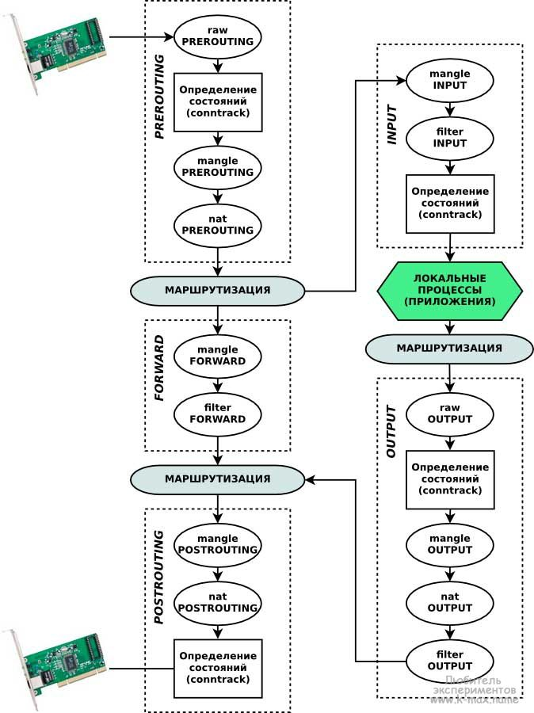

# 4. * Настроить проброс портов локально с порта 80 на порт 8080.

На 80 порту работает nginx, поэтому я решил поменять порты в условии
задачи. Решение задачи сводится к четырем основным шагам:
* с основной ОС заходим на порт 8080 виртуального хоста и получаем
  приветствие nginx;
* внутри виртуального хоста обращаясь на порт 8080 видим приветствие
  nginx;
* сделать виртуальный хост безопасным [пропустил этот шаг, однако,
  решал бы через шаблон приведенный лектором, расширенный пунктами
  текущего задания]
* закрыть порт 80 [до этого не дошел, не знаю ли возможно, если
  возможно, то предполагаю решать через маркировку трафика, а
  затем удаление не маркированного трафика]

При выполнении этого задания очень часто приходилось обращаться к
схеме прохождения пакетов:


## 1. Доступ из вне

При поступлении пакета из вне он попадает в интерфейс и в цепочку
`PREROUTING`. За изменение адресов отвечает таблица `nat`.

Для редиректа существует две основных цели "REDIRECT" и "DNAT",
ниже их команды:
```text
sudo iptables -t nat -A PREROUTING -p tcp --dport 8080 -j DNAT --to-destination 127.0.0.1:80
sudo iptables -t nat -A PREROUTING -p tcp --dport 8080 -j REDIRECT --to-port 80
```

## 2. Доступ внутри

Чтобы настроить доступ изнутри по порту 8080, следует понять откуда
начинает движение пакет при выполении команды:
```shell
echo "This is my TCP message" > /dev/tcp/127.0.0.1/8080
# or
curl localhost:8080
```

В ходе отладки было замечено, что если пакет приходит на открытый
порт, то он попадает на `lo`, иначе считается что входящий
интерфейс — любой:
```text
a@gb-udt:~$ sudo iptables -L -v
Chain INPUT (policy ACCEPT 1 packets, 105 bytes)
 pkts bytes target     prot opt in     out     source               destination
   13   780 DROP       tcp  --  any    any     anywhere             anywhere             tcp dpt:http-alt # echo "This is my TCP message" > /dev/tcp/127.0.0.1/8080
    0     0 DROP       tcp  --  lo     any     anywhere             anywhere             tcp dpt:http-alt
    2   120 DROP       tcp  --  lo     any     anywhere             anywhere             tcp dpt:http # echo "This is my TCP message" > /dev/tcp/127.0.0.1/80
```

Эта мысль породила гипотезу, что iptables учитывает открытые порты,
возможно, это тот самый блок маршрутизации на картинке.

Вторая гипотеза показала, что надо перенаправлять порты пакетов
при выходе из приложения, а раз приложение запущено локально,
то есть должно присутствовать на картинке и должно быть
`локальным процессом` и значит изменение доступно в цепочке
`OUTPUT`. Что подтвердилось следующим:
```text
a@gb-udt:~$ sudo iptables -t nat -A OUTPUT -p tcp --dport 8080 -j REDIRECT --to-port 80
a@gb-udt:~$ sudo iptables -t nat -L -v
...
Chain OUTPUT (policy ACCEPT 0 packets, 0 bytes)
 pkts bytes target     prot opt in     out     source               destination
    0     0 REDIRECT   tcp  --  any    any     anywhere             anywhere             tcp dpt:http-alt redir ports 80
...
a@gb-udt:~$ echo "This is my TCP message" > /dev/tcp/127.0.0.1/8080
a@gb-udt:~$ sudo iptables -t nat -L -v
...
Chain OUTPUT (policy ACCEPT 0 packets, 0 bytes)
 pkts bytes target     prot opt in     out     source               destination
    1    60 REDIRECT   tcp  --  any    any     anywhere             anywhere             tcp dpt:http-alt redir ports 80
...
a@gb-udt:~$ curl localhost:8080
<!DOCTYPE html>
<html>
<head>
<title>Welcome to nginx!</title>
<!-- ... -->
```

Примечание: реально отслеживая счетчики пакетов можно понимать,
как работает `iptables`.

Отсюда вторая команда:
```shell
sudo iptables -t nat -A OUTPUT -p tcp --dport 8080 -j REDIRECT --to-port 80
```

У пакета приложения `curl localhost:8080` при прохождении цепочки `OUTPUT`
меняется порт с `8080` на `80`. И именно пакет с 80 портом заходит в 
цепочку `PREROUTING`, но это не тестировал, где маршрутизируется на
`nginx`.