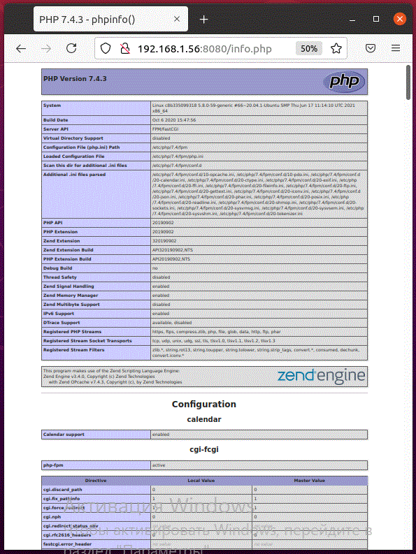

# 2. * Используя Dockerfile, собрать связку nginx + PHP-FPM в одном контейнере.

## Материалы

* [How to install without answering the quesitons?](https://askubuntu.com/questions/1274445/how-to-install-python-opencv-without-answering-the-quesitons)
> `DEBIAN_FRONTEND="noninteractive" apt-get install --yes python-opencv`
* [Установка Linux, Nginx, MySQL, PHP (набора LEMP) в Ubuntu 18.04](https://www.digitalocean.com/community/tutorials/how-to-install-linux-nginx-mysql-php-lemp-stack-ubuntu-18-04-ru)
> Пример установки, взял статью за базу.
* [cmd to run nginx](https://docs.nginx.com/nginx/admin-guide/installing-nginx/installing-nginx-docker/)
* [General guidelines and recommendations](https://docs.docker.com/develop/develop-images/dockerfile_best-practices/)
* [How do you restart php-fpm?](https://serverfault.com/questions/189940/how-do-you-restart-php-fpm)
* [How to start two services in one docker container](https://stackoverflow.com/questions/61533652/how-to-start-two-services-in-one-docker-container)
* [Dockerise your PHP application with Nginx and PHP7-FPM](http://geekyplatypus.com/dockerise-your-php-application-with-nginx-and-php7-fpm/)

docker create -ti  bash
docker start -ai 3e57471160d618adca58e32b1f83c5e1bc6aa3d8c5b8c90c330fa53b34535f70

## Установка

Команды для установки `nginx` и `php-fpm`:
```shell
apt update
# apt install -y nginx # breaks with prompts
# DEBIAN_FRONTEND="noninteractive" apt install -y nginx # works
DEBIAN_FRONTEND="noninteractive" apt install -y nginx php-fpm # works
#apt install -y tzdata nginx # breaks with prompts
```

## Образы и контейнеры

Команды выполняемые для сборки образа и манипуляции контейнеров:
```shell
echo 'Hi no name!' | sudo tee /var/www/html/index.html
echo '<?php phpinfo(); ?>' | sudo tee /var/www/html/info.php

docker stop nginx-php
docker rm nginx-php
docker image rm nginx-php
docker build -t nginx-php .
docker run -d --name nginx-php -p 8080:80 -v /var/www/html/:/var/www/html/  -v $(pwd)/etc/nginx/sites-available/:/etc/nginx/sites-available/ nginx-php
curl localhost:8080

docker exec -ti nginx-php /bin/bash
#docker run -d --name nginx-php -p 8080:80 -v /var/www/html/:/var/www/html/ nginx-php # works
```

## Не работает `php`

Web-сервер не работает с php-файлами, поскольку сервис `php7.4-fpm` не запущен,
и как следствие его сокет не доступен:
```text
docker logs nginx-php 
# nginx: [emerg] "fastcgi_pass" directive is duplicate in /etc/nginx/sites-enabled/default:26
root@8f774d8638d0:/# cat /var/log/nginx/error.log 
# 2021/06/26 12:08:35 [crit] 7#7: *1 connect() to unix:/var/run/php/php7.4-fpm.sock failed (2: No such file or directory) while connecting to upstream, client: 172.17.0.1, server: _, request: "GET /info.php HTTP/1.1", upstream: "fastcgi://unix:/var/run/php/php7.4-fpm.sock:", host: "localhost:8080"

root@8f774d8638d0:/# ls -al /var/run/php/
total 8
drwxr-xr-x 2 www-data www-data 4096 Jun 26 11:41 .
drwxr-xr-x 1 root     root     4096 Jun 26 12:08 ..

/etc/init.d/php7.4-fpm start # to run fpm and nginx
```
Проблема устраняется ручным запуском сервиса `php7.4-fpm`.

## nginx -> default

Конфигурационный файл `nginx`:
```text
root@121443b72ef7:/# cat /etc/nginx/sites-available/default 
server {
	listen 80 default_server;
	listen [::]:80 default_server;

	root /var/www/html;

	# Add index.php to the list if you are using PHP
	index index.html index.htm index.nginx-debian.html;

	server_name _;

	location / {
		# First attempt to serve request as file, then
		# as directory, then fall back to displaying a 404.
		try_files $uri $uri/ =404;
	}

	# pass PHP scripts to FastCGI server
	#
	#location ~ \.php$ {
	#	include snippets/fastcgi-php.conf;
	#
	#	# With php-fpm (or other unix sockets):
	#	fastcgi_pass unix:/var/run/php/php7.4-fpm.sock;
	#	# With php-cgi (or other tcp sockets):
	#	fastcgi_pass 127.0.0.1:9000;
	#}
}
```

## Два процесса

Запуск двух процессов в одном докере:
* [How to start two services in one docker container](https://stackoverflow.com/questions/61533652/how-to-start-two-services-in-one-docker-container)
* [Dockerise your PHP application with Nginx and PHP7-FPM](http://geekyplatypus.com/dockerise-your-php-application-with-nginx-and-php7-fpm/)

Использую первый вариант:
start.sh:
```shell
#!/bin/bash

/etc/init.d/php7.4-fpm start &
nginx -g "daemon off;"
```

## Готово


